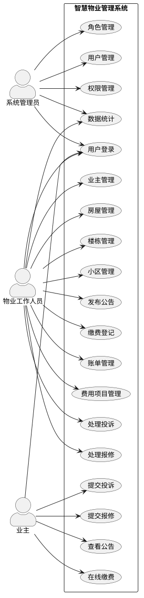
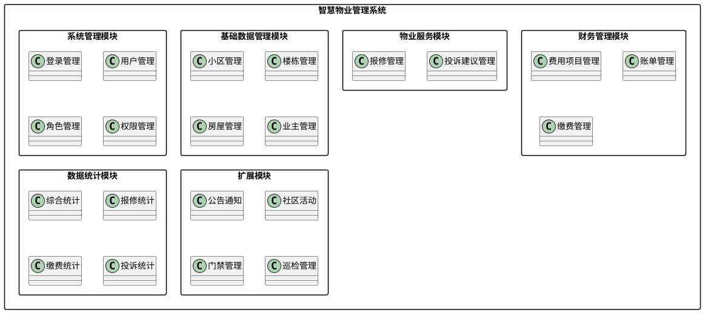

# 智慧物业管理系统需求分析

# 1. 项目背景

随着城市住宅小区数量不断增加，传统物业管理方式逐渐暴露出信息分散、业务处理效率低、沟通成本高、数据统计困难等问题。许多物业公司仍采用纸质登记或多个独立系统进行管理，导致业主报修响应慢、收费统计繁琐、信息查询不便，难以满足现代物业管理需求。

为了提高物业管理的信息化水平，本项目设计并开发一套基于 **Spring Boot + Vue3** 的智慧物业管理系统，实现物业管理业务数字化、流程化和智能化。系统将整合用户管理、基础数据管理、物业服务管理、财务管理和数据统计等功能，实现物业管理全过程的信息化，提高物业工作人员办公效率，提升业主服务体验。

本项目作为Java实训项目，采用前后端分离架构，后端使用 Spring Boot 框架开发，前端采用 Vue3 + Element Plus，实现完整的智慧物业管理业务流程。

---

# 2. 功能需求说明

根据物业公司的日常业务流程，系统划分为以下几个功能模块。

## 2.1 系统管理模块

用于系统用户及权限管理，保证系统安全运行。

主要功能包括：

- 用户登录
- 用户管理
  - 新增用户
  - 修改用户
  - 删除用户
  - 查询用户
  - 分页查询
- 角色管理
- 用户角色分配
- 菜单权限管理
- 登录认证
- 权限控制

---

## 2.2 基础数据管理模块

用于维护物业基础信息，是整个系统的数据基础。

主要包括：

### 小区管理

- 小区新增
- 小区修改
- 小区删除
- 小区查询

### 楼栋管理

- 楼栋新增
- 楼栋修改
- 楼栋删除
- 楼栋关联所属小区

### 房屋管理

- 房屋新增
- 房屋修改
- 房屋删除
- 房屋状态管理
- 房屋关联楼栋

### 业主管理

- 业主信息维护
- 房屋绑定业主
- 查询业主房屋信息

---

## 2.3 物业服务模块

实现物业公司与业主之间的业务办理。

### 报修管理

主要流程：

业主提交报修 →

物业受理 →

物业派单 →

维修完成 →

业主确认评价

功能包括：

- 报修申请
- 报修查询
- 状态跟踪
- 派单处理
- 完工确认
- 服务评价

### 投诉建议管理

主要功能：

- 提交投诉
- 查询投诉
- 回复投诉
- 修改处理状态

---

## 2.4 财务管理模块

实现物业收费管理。

主要功能：

- 费用项目管理
- 自动生成账单
- 查询账单
- 缴费登记
- 缴费状态查询

---

## 2.5 数据统计模块

为物业管理人员提供数据分析。

包括：

- 小区入住率统计
- 房屋数量统计
- 报修统计
- 缴费率统计
- 投诉处理统计
- 综合数据看板

---

## 2.6 扩展功能（选做）

为了进一步提升物业服务能力，可增加以下功能：

- 公告通知
- 社区活动
- 快递代收
- 门禁管理
- 巡检管理
- 车辆管理

---

# 3. 用户角色说明

系统主要包括三类用户。

| 用户角色     | 主要职责           | 主要权限                                                             |
| ------------ | ------------------ | -------------------------------------------------------------------- |
| 系统管理员   | 系统维护、权限配置 | 用户管理、角色管理、权限管理、系统配置                               |
| 物业工作人员 | 日常物业业务办理   | 小区管理、楼栋管理、房屋管理、业主管理、报修处理、投诉处理、收费管理 |
| 业主         | 使用物业服务       | 登录系统、提交报修、提交投诉、查看账单、缴纳物业费、查看公告         |

---

## 各角色权限说明

### （1）系统管理员

负责整个系统运行维护。

权限包括：

- 用户管理
- 角色管理
- 权限配置
- 查看全部业务数据
- 系统参数维护

---

### （2）物业工作人员

负责物业日常管理。

权限包括：

- 基础信息维护
- 报修处理
- 投诉处理
- 账单管理
- 缴费登记
- 发布公告
- 数据统计

---

### （3）业主

主要使用物业服务。

权限包括：

- 登录系统
- 查看个人房屋
- 提交报修
- 提交投诉建议
- 查询账单
- 在线缴费
- 查看公告

---

# 4. 业务流程图

## 4.1 用户登录流程

```text
开始
  │
  ▼
输入用户名和密码
  │
  ▼
验证账号信息
  │
 ┌───────┐
 │验证成功│
 └───┬───┘
     │是
     ▼
生成Token
     │
     ▼
进入系统首页
     │
     ▼
结束

验证失败
     │
     ▼
提示用户名或密码错误
```

---

## 4.2 报修业务流程

```text
业主提交报修
      │
      ▼
物业受理
      │
      ▼
派发维修人员
      │
      ▼
维修处理
      │
      ▼
维修完成
      │
      ▼
业主确认
      │
      ▼
服务评价
      │
      ▼
流程结束
```

---

## 4.3 投诉处理流程

```text
业主提交投诉
      │
      ▼
物业接收投诉
      │
      ▼
工作人员处理
      │
      ▼
回复处理结果
      │
      ▼
业主查看回复
      │
      ▼
投诉结束
```

---

## 4.4 缴费业务流程

```text
物业生成账单
      │
      ▼
业主查看账单
      │
      ▼
确认缴费
      │
      ▼
物业登记缴费
      │
      ▼
更新账单状态
      │
      ▼
缴费完成
```

---

## 5. 功能结构图

```text
智慧物业管理系统
│
├── 系统管理
│   ├── 登录
│   ├── 用户管理
│   ├── 角色管理
│   └── 权限管理
│
├── 基础数据管理
│   ├── 小区管理
│   ├── 楼栋管理
│   ├── 房屋管理
│   └── 业主管理
│
├── 物业服务
│   ├── 报修管理
│   └── 投诉建议
│
├── 财务管理
│   ├── 费用项目
│   ├── 账单管理
│   └── 缴费管理
│
└── 数据统计
    ├── 综合看板
    ├── 报修统计
    ├── 缴费统计
    └── 投诉统计
```

# 5.附图

系统用例图



功能模块图


