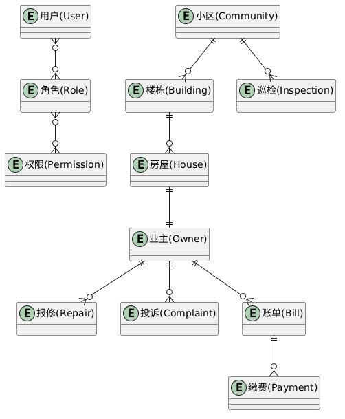
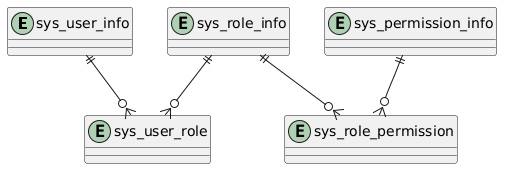
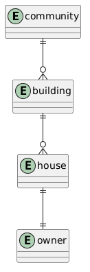
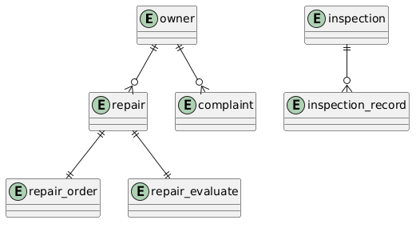
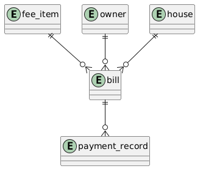

# 智慧物业管理系统数据库设计

# 1. 数据库概述

### 1.1 数据库名称

```text
property_management
```

### 1.2 数据库简介

智慧物业管理系统数据库用于支撑物业管理业务的运行，实现用户权限管理、基础信息管理、物业服务管理和财务管理等功能。

数据库采用 MySQL 8.0 设计，共包含 18 张业务数据表，通过主键、外键和索引保证数据完整性和查询性能。

### 1.3 模块划分

数据库按照业务功能划分为四个模块：

| 模块         | 表数量 | 主要功能                   |
| ------------ | ------ | -------------------------- |
| 权限管理模块 | 5      | 用户、角色、权限控制       |
| 基础信息模块 | 4      | 小区、楼栋、房屋、业主管理 |
| 物业业务模块 | 6      | 报修、投诉、巡检业务       |
| 财务管理模块 | 3      | 费用项目、账单、缴费管理   |

---

# 2. ER图设计

## 2.1 系统总体ER图



---

## 2.2 权限管理ER图




---

## 2.3 基础信息ER图



---

## 2.4 物业业务ER图



---

## 2.5 财务管理ER图



---

# 3. 表结构设计

---

## 3.1 权限管理模块

### 3.1.1 用户表（sys_user_info）

| 字段名称       | 类型         | 主键 | 说明         |
| -------------- | ------------ | ---- | ------------ |
| id             | BIGINT       | √   | 用户ID       |
| user_name      | VARCHAR(64)  |      | 登录账号     |
| password       | VARCHAR(128) |      | 登录密码     |
| full_name      | VARCHAR(128) |      | 用户姓名     |
| phone_number   | VARCHAR(16)  |      | 手机号码     |
| avatar_address | VARCHAR(128) |      | 头像地址     |
| deleted        | INT          |      | 逻辑删除标识 |

---

### 3.1.2 角色表（sys_role_info）

| 字段名称    | 类型         | 主键 | 说明     |
| ----------- | ------------ | ---- | -------- |
| id          | BIGINT       | √   | 角色ID   |
| role_code   | VARCHAR(128) |      | 角色编码 |
| role_name   | VARCHAR(255) |      | 角色名称 |
| description | VARCHAR(255) |      | 描述     |

---

### 3.1.3 权限表（sys_permission_info）

| 字段名称        | 类型         | 主键 | 说明     |
| --------------- | ------------ | ---- | -------- |
| id              | BIGINT       | √   | 权限ID   |
| permission_code | VARCHAR(128) |      | 权限编码 |
| permission_name | VARCHAR(255) |      | 权限名称 |
| permission_type | INT          |      | 权限类型 |
| parent_id       | BIGINT       |      | 父节点ID |

---

### 3.1.4 用户角色关联表（sys_user_role）

| 字段名称     | 类型   | 说明   |
| ------------ | ------ | ------ |
| id           | BIGINT | 主键   |
| user_info_id | BIGINT | 用户ID |
| role_info_id | BIGINT | 角色ID |

---

### 3.1.5 角色权限关联表（sys_role_permission）

| 字段名称           | 类型   | 说明   |
| ------------------ | ------ | ------ |
| id                 | BIGINT | 主键   |
| role_info_id       | BIGINT | 角色ID |
| permission_info_id | BIGINT | 权限ID |

---

## 3.2 基础信息模块

### 3.2.1 小区表（community）

| 字段名称          | 类型          | 主键 | 说明     |
| ----------------- | ------------- | ---- | -------- |
| id                | BIGINT        | √   | 小区ID   |
| community_name    | VARCHAR(128)  |      | 小区名称 |
| community_address | VARCHAR(255)  |      | 小区地址 |
| area              | DECIMAL(10,2) |      | 小区面积 |
| developer         | VARCHAR(128)  |      | 开发商   |
| property_company  | VARCHAR(128)  |      | 物业公司 |
| status            | INT           |      | 状态     |

---

### 3.2.2 楼栋表（building）

| 字段名称        | 类型        | 主键 | 说明     |
| --------------- | ----------- | ---- | -------- |
| id              | BIGINT      | √   | 楼栋ID   |
| community_id    | BIGINT      |      | 所属小区 |
| building_name   | VARCHAR(64) |      | 楼栋名称 |
| total_floors    | INT         |      | 总层数   |
| units_per_floor | INT         |      | 每层户数 |

---

### 3.2.3 房屋表（house）

| 字段名称     | 类型          | 主键 | 说明     |
| ------------ | ------------- | ---- | -------- |
| id           | BIGINT        | √   | 房屋ID   |
| building_id  | BIGINT        |      | 楼栋ID   |
| house_number | VARCHAR(32)   |      | 房屋编号 |
| floor        | INT           |      | 楼层     |
| area         | DECIMAL(10,2) |      | 房屋面积 |
| house_type   | VARCHAR(32)   |      | 户型     |
| status       | INT           |      | 房屋状态 |

---

### 3.2.4 业主表（owner）

| 字段名称     | 类型        | 主键 | 说明     |
| ------------ | ----------- | ---- | -------- |
| id           | BIGINT      | √   | 业主ID   |
| owner_name   | VARCHAR(64) |      | 姓名     |
| phone_number | VARCHAR(16) |      | 电话     |
| id_card      | VARCHAR(18) |      | 身份证号 |
| house_id     | BIGINT      |      | 房屋ID   |
| relationship | VARCHAR(32) |      | 房屋关系 |

---

## 3.3 物业业务模块

### 报修表（repair）

主要记录业主报修信息。

| 字段           | 类型        | 说明     |
| -------------- | ----------- | -------- |
| id             | BIGINT      | 主键     |
| repair_no      | VARCHAR(64) | 报修单号 |
| owner_id       | BIGINT      | 报修业主 |
| house_id       | BIGINT      | 房屋     |
| repair_type    | VARCHAR(64) | 报修类型 |
| repair_content | TEXT        | 报修内容 |
| status         | INT         | 处理状态 |

---

### 派单表（repair_order）

记录维修人员处理情况。

| 字段          | 类型     | 说明     |
| ------------- | -------- | -------- |
| id            | BIGINT   | 主键     |
| repair_id     | BIGINT   | 报修单   |
| worker_id     | BIGINT   | 维修人员 |
| assign_time   | DATETIME | 派单时间 |
| complete_time | DATETIME | 完成时间 |
| status        | INT      | 状态     |

---

### 报修评价表（repair_evaluate）

记录业主评价信息。

---

### 投诉建议表（complaint）

记录投诉与建议业务。

---

### 巡检表（inspection）

记录巡检任务。

---

### 巡检整改表（inspection_record）

记录巡检发现的问题及整改情况。

---

## 3.4 财务管理模块

### 费用项目表（fee_item）

用于维护物业费、水费、电费等收费项目。

---

### 账单表（bill）

用于生成业主缴费账单。

核心字段：

| 字段        | 类型          | 说明     |
| ----------- | ------------- | -------- |
| bill_no     | VARCHAR(64)   | 账单编号 |
| owner_id    | BIGINT        | 业主     |
| fee_item_id | BIGINT        | 费用项目 |
| amount      | DECIMAL(10,2) | 应收金额 |
| paid_amount | DECIMAL(10,2) | 已缴金额 |
| status      | INT           | 缴费状态 |

---

### 缴费记录表（payment_record）

用于记录业主实际缴费情况。

---

# 4. 表关系说明

## 4.1 权限管理关系

| 主表                | 从表                | 关系 |
| ------------------- | ------------------- | ---- |
| sys_user_info       | sys_user_role       | 1:N  |
| sys_role_info       | sys_user_role       | 1:N  |
| sys_role_info       | sys_role_permission | 1:N  |
| sys_permission_info | sys_role_permission | 1:N  |

系统采用 RBAC 权限模型，实现用户、角色、权限之间的解耦。

---

## 4.2 基础信息关系

| 主表      | 从表     | 关系 |
| --------- | -------- | ---- |
| community | building | 1:N  |
| building  | house    | 1:N  |
| house     | owner    | 1:1  |

---

## 4.3 物业业务关系

| 主表       | 从表              | 关系 |
| ---------- | ----------------- | ---- |
| owner      | repair            | 1:N  |
| repair     | repair_order      | 1:1  |
| repair     | repair_evaluate   | 1:1  |
| owner      | complaint         | 1:N  |
| inspection | inspection_record | 1:N  |

---

## 4.4 财务管理关系

| 主表     | 从表           | 关系 |
| -------- | -------------- | ---- |
| fee_item | bill           | 1:N  |
| owner    | bill           | 1:N  |
| house    | bill           | 1:N  |
| bill     | payment_record | 1:N  |

---

# 5. 索引设计

## 5.1 主键索引

所有业务表均采用 BIGINT 类型主键，并自动创建主键索引。

例如：

```sql
PRIMARY KEY(id)
```

---

## 5.2 唯一索引

| 索引名称         | 表名              | 字段          |
| ---------------- | ----------------- | ------------- |
| uk_repair_no     | repair            | repair_no     |
| uk_complaint_no  | complaint         | complaint_no  |
| uk_inspection_no | inspection        | inspection_no |
| uk_record_no     | inspection_record | record_no     |
| uk_bill_no       | bill              | bill_no       |
| uk_payment_no    | payment_record    | payment_no    |
| uk_fee_code      | fee_item          | fee_code      |

---

## 5.3 外键索引

| 索引名称                  | 表名           | 字段         |
| ------------------------- | -------------- | ------------ |
| idx_building_community_id | building       | community_id |
| idx_house_building_id     | house          | building_id  |
| idx_owner_house_id        | owner          | house_id     |
| idx_repair_owner_id       | repair         | owner_id     |
| idx_bill_owner_id         | bill           | owner_id     |
| idx_payment_bill_id       | payment_record | bill_id      |

---

## 5.4 逻辑删除索引

系统采用逻辑删除机制：

```sql
deleted INT DEFAULT 0
```

并建立：

```sql
idx_deleted
```

用于提高查询效率。

---

# 6. 数据库设计总结

本系统数据库采用关系型数据库 MySQL 进行设计，共设计18张业务表，覆盖权限管理、基础信息管理、物业业务管理和财务管理四大核心模块。数据库设计遵循第三范式，通过主键、外键和索引保证数据完整性和一致性。

在性能优化方面，系统针对业务编号、外键字段和逻辑删除字段建立了主键索引、唯一索引和普通索引，提高了系统查询效率和并发处理能力，能够满足智慧物业管理系统的业务需求。
